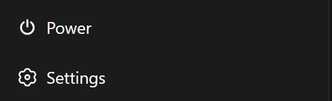
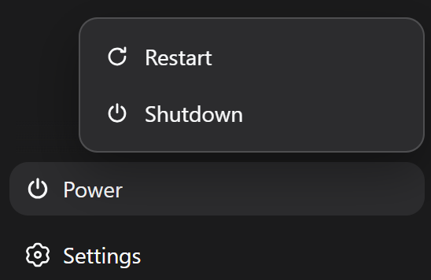
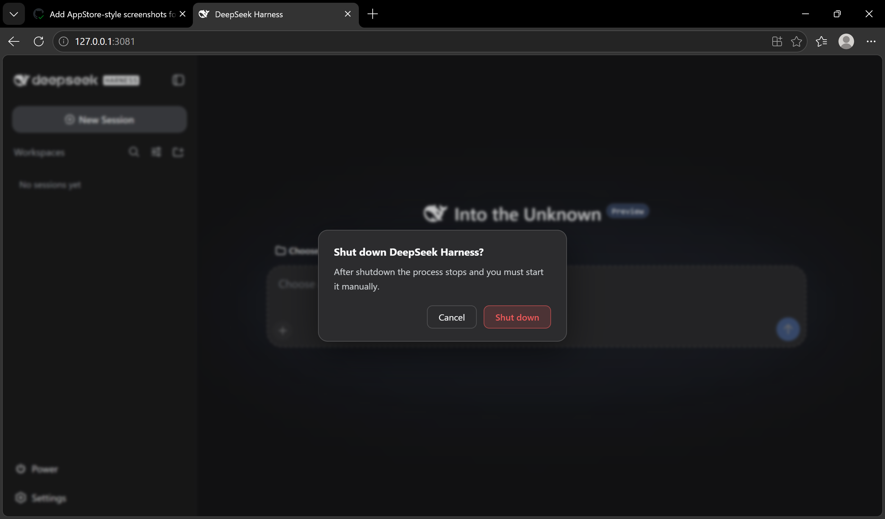
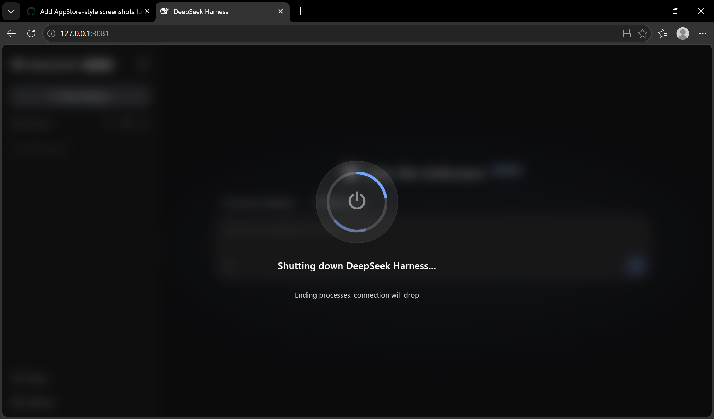

# dsh-power-button

[](LICENSE)
[](https://github.com/deepseek-ai/DeepSeek-Harness)

[English](README.md) | [中文](README.zh-CN.md)

A self-contained **power & lifecycle controller** for [DeepSeek Harness](https://github.com/deepseek-ai/DeepSeek-Harness): a sidebar power button with a Restart / Shutdown menu and a full-screen transition overlay. The restart/shutdown engine is built into the plugin — no third-party dependencies.

> Developed with DeepSeek AI assistance; reviewed before release.

## Features

- **Sidebar power button** in the footer action slot, theme-aware and styled to match the adjacent Settings trigger.
- **Restart / Shutdown menu** with a Windows-style full-screen transition overlay; the page auto-reloads after a confirmed restart.
- **Self-contained restart engine**: writes a detached `.cjs` helper that takes over relaunching DSH through an ARM → COMMIT → ACK handshake, waits for the old process to exit, the port to free, and the session logs to stop growing, then relaunches with the same invocation and cwd — an ephemeral `--port 0` is pinned to the port this process actually bound — and confirms the new instance by `restartId`. No PowerShell, no `taskkill`.
- **`/restart` and `/shutdown` commands**, a **`restart_harness` model tool** (same name as `anweat/dsh-restart`; registration is skipped when another plugin already owns the name), and a read-only **`restart_status`** tool for checking whether a restart happened.
- **Localized UI and host notices** (zh / en), following the profile's `locale.preference`.
- **Startup housekeeping**: helper logs and scripts, per-restart handshake records, and undelivered restart notices older than 7 days are pruned from the runtime directory.

## Screenshots

**① Sidebar power button** — a theme-aware footer entry, styled to match the adjacent Settings trigger.



**② Restart / Shutdown menu** — opens from the power button; two actions, one click away.



**③ Shutdown confirm dialog** — guard against accidental shutdowns: the default focus sits on **Cancel**, and only an explicit confirm actually stops the process.



**④ Shutdown progress overlay** — a Windows-style full-screen transition showing the current stage while the process winds down.



**⑤ Restart completed toast** — after the page auto-reloads, a success notice confirms DSH is back.


## Install

```sh
dsh plugin --profile web add "github:keyiadiannao/dsh-power-button#master"
```

Restart DSH; a power button appears in the sidebar footer. Requires Node ≥ 22.19.

## Configuration

The plugin is configured through the profile's cordis layer (`cordis.patch.yml` or the settings UI):

| Key | Default | Meaning |
|---|---|---|
| `enableModelTool` | `true` | Register the `restart_harness` model tool. Set `false` to keep restart exclusively on the GUI button and `/restart`. |
| `maxDelayMs` | `5000` | Upper bound (ms) for the model tool's `delayMs` argument. The effective floor is 1000 ms. |
| `restartWakeMode` | `quiet` | What the session that asked for a restart is told afterwards. `quiet` stages the notice for its next step without waking anything. `notify` additionally wakes that session once it is live, so the model reports the restart without the user sending a message. Neither mode ever restarts again on its own. |

Example:

```yaml
- id: dsh-power-button
  config:
    enableModelTool: true
```

## How it works

The old process may not exit until a live successor has taken responsibility for
relaunching it. That is an explicit ARM → COMMIT → ACK handshake: an exit with
nobody left to relaunch is the one outcome the UI cannot recover from, so every
failure before the ACK leaves the old process running.

```
click power → menu → Restart
[host]    POST /api/dsh-power-button/restart
          → write the per-restart helper .cjs (0600: it embeds the relaunch argv)
          → spawn `node <helper>` (detached, windowsHide)
[helper]  ARM   → status { stage: 'armed', armedAt }
[host]    wait for ARMED (5 s) → write the COMMIT file for this restartId
[helper]  ACK   → status { stage: 'committed', committedAt }
[host]    only now: unref the helper → flush live sessions (capped at 5 s)
          → request exit after delayMs, with a 15 s watchdog behind it
[helper]  wait for the old PID to exit (bounded by the host's own budget)
          → wait for the port to free
          → wait for session logs to stop growing (quiescence)
          → write the v2 marker, then spawn DSH with the same invocation
            and cwd, plus a DSH_POWER_RESTART_ID launch token. A `--port 0`
            command line is rewritten to the port this process actually bound,
            so the
            successor lands on the port the helper is waiting for
          → poll /health until ok && instanceId != old && restart.restartId matches
          → self-delete
[client]  poll health → confirm new instanceId → auto reload
```

Shutdown posts `/api/dsh-power-button/shutdown` and terminates without relaunching. Because it is irreversible (the process must be started manually), both the power button **and** `/shutdown` open a GUI confirm dialog first — a second click is required. The model never exposes shutdown.

Design notes (from real issues hit during development):

- The helper must run **outside the process tree** (`detached` + `unref`), otherwise terminating DSH kills the helper mid-flight.
- The helper is a **real `.cjs` file**, not `node -e`: multi-line `node -e` scripts are mangled by Windows `CreateProcess` and die with a silent `SyntaxError`.
- Restart success is confirmed by a per-process `instanceId` that must **change** (old → new), so a brief outage alone never fakes success.
- **Durable-write quiescence**: after the old process exits and the port frees, the helper polls every session log's `(size, mtimeMs)` until two consecutive samples are identical (bounded at ~15s) before relaunching. The old process's session write-behind buffer can keep draining after its main loop exits; relaunching into a file that is still being appended interleaves stale seq numbers and corrupts the session — this check closes that window.
- **The launcher's exit request is read as a service, not a property**: it lives at `ctx.get('appExit')`. `appExit` is an optional host value this plugin does not declare in `inject`, so the context proxy resolves `ctx.appExit` to `undefined` — reading it as a property silently skipped graceful disposal on *every* restart and shutdown, hard-killing through `process.exit` instead (losing the tree teardown, the storage flush, and the port release). Official readers (`dsh-cmdline`, `dsh-headless`) go through `ctx.get` for the same reason.
- **Graceful exit is bounded, and so is the pre-exit flush**: after requesting `appExit`, a 15s watchdog hard-exits if the process is still alive; the session flush before it is capped at 5s. The helper's patience for the old PID is **derived** from that budget (`flush cap + delayMs + watchdog`, plus margin) rather than written as a second constant. An unbounded flush used to sit between the helper's COMMIT and the process exit while the helper waited a fixed 30s — a flush past roughly 13.5s already meant the helper gave up **without relaunching** and the user was left with no server. Deriving the two from each other is what keeps them from drifting apart.

## Safety

- Destructive POSTs are protected by a **same-origin / loopback guard** (CSRF): the socket must be loopback, `Host` must be a loopback authority, and a browser `Origin` must match. `/api/dsh-power-button/*` is longer than the official `/api` route, so longest-prefix matching never routes these requests through DSH's own trust fence — this guard is the only one they get.
- That guard applies the **same rules** as DSH's official fence but is deliberately **narrower in one place**: it accepts only `127.0.0.1`, `::1` and `localhost` as loopback, where the official helper accepts the whole of `127/8`. Narrower cannot admit anything the official fence refuses; the cost is that if DSH ever serves another `127/8` address, its own routes would answer while these returned 403.
- The `Origin` check compares the full authority, matching upstream. A browser that ever sends a port-less loopback `Origin` (reported, not standardised) would be refused by both fences — this plugin does not relax it unilaterally, and `tests/trust-fence.spec.ts` pins the current behaviour so a change is deliberate rather than incidental.
- An **at-most-once latch** rejects duplicate transitions (a concurrent second POST gets `409`).
- The model tool's `delayMs` is **floored at 1000 ms** — the model cannot kill the process before its own turn settles.
- The restart marker is **consumed (deleted) on boot**, so a later ordinary launch never misreports a restart.
- Command-line logging is **redacted** (credentials never reach `~/.dsh/restart-helper-<pid>.log`); helper and marker files are written `0600`, the runtime directory `0700`.

## What the conversation learns after a restart

Three separate things, deliberately not one:

- **The UI** shows a localized "Restarted" / "已重启" toast. The process keeps its
  restart identity on `/health` (`restart.fromInstanceId`, `restart.restartId`)
  for its whole lifetime; acknowledging the toast clears only the pending flag,
  never the identity.
- **The session that asked** receives a restart notice, in one of the two
  `restartWakeMode` shapes. `quiet` passes it to `Agent.inject()`, which stages
  it for that session's next step without waking anything; `notify` uses
  `Agent.followup()` so the session wakes — once it is live — and reports the
  restart with no user message at all. Only a restart with a recorded causal
  session gets a notice: a GUI click records none, and is never attributed to
  whichever conversation happens to be open. At most one notice per session is
  queued, and it is deleted once delivered.
- **Every other session** can ask the `restart_status` tool, which reports the
  durable record: whether a restart happened, its id, stage, the instance it
  replaced and the one it produced, timings, who asked for it, and whether the
  running process is the instance that restart produced. This is how a model
  finds out about a restart it did not initiate.

The plugin never appends a model-visible message itself and never forges a turn.
It hands the notice to the Agent API — `inject()` durably stages an
`agent/inbox/spliced` record for the next legitimate step to claim, and
`followup()` is the documented wake path. An earlier design appended a synthetic
`assistant/message` (`turn: 0, step: 0`) into the resumed conversation — that
tripped the token-meter's step-pairing invariant and could corrupt large
sessions, so it was removed. Tracked upstream:
[deepseek-ai/DeepSeek-Harness#802](https://github.com/deepseek-ai/deepseek-harness/discussions/802).

Delivery is once per notice in normal operation. The notice file and the agent
inbox are two durable states with no transaction between them, so a host crash
in the window after the inbox write and before the deletion delivers the notice
again on the next boot. That is accepted deliberately: claiming the notice
first would trade a possible duplicate for a possible lost notice, and the
notice text is written so a repeat is harmless — it says the restart already
happened and that nothing else should be resumed.

Mechanics:
- The helper writes the restart marker **before** spawning the new process and
  hands it a `DSH_POWER_RESTART_ID` launch token in the child's environment, so
  the relaunched instance can claim the restart no matter how early it boots
  (an earlier protocol confirmed the relaunch only after the child spawned, and
  a fast boot could read "no marker yet" and miss it).
- On boot the plugin accepts the current **v2** marker only when the launch
  token matches, so a manual boot never misreports a restart; the previous
  **v1** confirmation (helper-recorded child pid) is still accepted, keeping
  restarts performed by a pre-upgrade 0.2.2 helper working across the upgrade.
- On boot, if the restart marker was consumed, `/health` reports the restart
  **identity** — `restart: { restartId, fromInstanceId }` — permanently for
  this process's lifetime, so the helper's ready gate (and future
  diagnostics) can always tell a relaunched instance from a fresh boot. The
  toast flag `restarted: true, fromInstanceId: <old>` is separate: it
  disappears once the client ACKs via `/notice-shown`, without erasing the
  identity.
- `/health` also reports `appExit: "available" | "missing"` — whether the
  launcher-provided exit channel actually resolves in this host. `missing`
  means every restart falls back to `process.exit` (no graceful disposal), so
  the field turns a delayed restart into a one-request diagnosis instead of
  something only noticed once the helper gives up on the old pid.
- The client checks `/health` once after load; when `restarted` is true it
  shows the toast, then ACKs via `POST /api/dsh-power-button/notice-shown`
  so a later refresh does not re-show it.
- The plugin never appends synthetic model-visible session events itself; restart
  awareness is handed to the Agent API, so a restart still cannot corrupt session
  logs or leave unpaired events behind.

## Development

```sh
pnpm build            # tsdown: host + client bundle (committed to lib/)
pnpm typecheck        # tsc --noEmit over src
pnpm typecheck:tests  # the root tsconfig excludes tests/, and vitest only transpiles them
pnpm test             # vitest: unit + process-level acceptance
pnpm check            # all of the above, in order
```

CI runs on Windows, Ubuntu and macOS: install, both typechecks, tests, build, a
gate that the committed `lib/` matches a fresh build byte for byte (a git install
runs those artifacts, so they must be what the source produces), and a `pnpm pack`
check that the published tarball actually contains `lib/` and `cordis.patch.yml`.
A separate Linux job runs the same steps on Node **22.19**, the floor
`engines.node` declares — nothing else here would otherwise exercise it.

`tests/restart-runtime.spec.ts` is a process-level acceptance suite: it
executes the EXACT helper script the host generates (`buildRestartHelper`) as
a real process against two fake DSH targets on a real TCP port, and pins the
outcomes that unit tests cannot prove — the full relaunch chain, no relaunch
without the host's COMMIT, spawn retries bounded at three, the health gate
refusing an old-instanceId answer, and a `--port 0` restart landing the
successor on the port the old process actually bound (the successor's argv goes
through the plugin's own `pinRelaunchPort`, so the test exercises the fix rather
than restating it).

Tests isolate `DSH_HOME` via a vitest setup file, so they never touch your
real `~/.dsh`. Artifacts: host at `lib/index.js`, client bundle at
`lib/client.js` (both committed — git installs are build-free).

## License & Attribution

MIT. The "detached helper relaunch" idea follows [anweat/dsh-restart](https://github.com/anweat/dsh-restart) (MIT); the implementation is independently written (real `.cjs` file, no PowerShell, dynamic port), no code copied.
