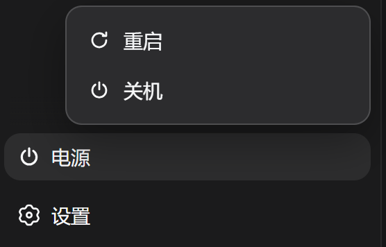
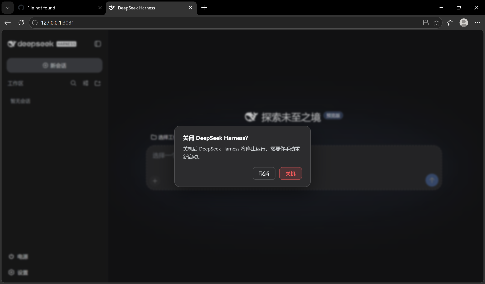
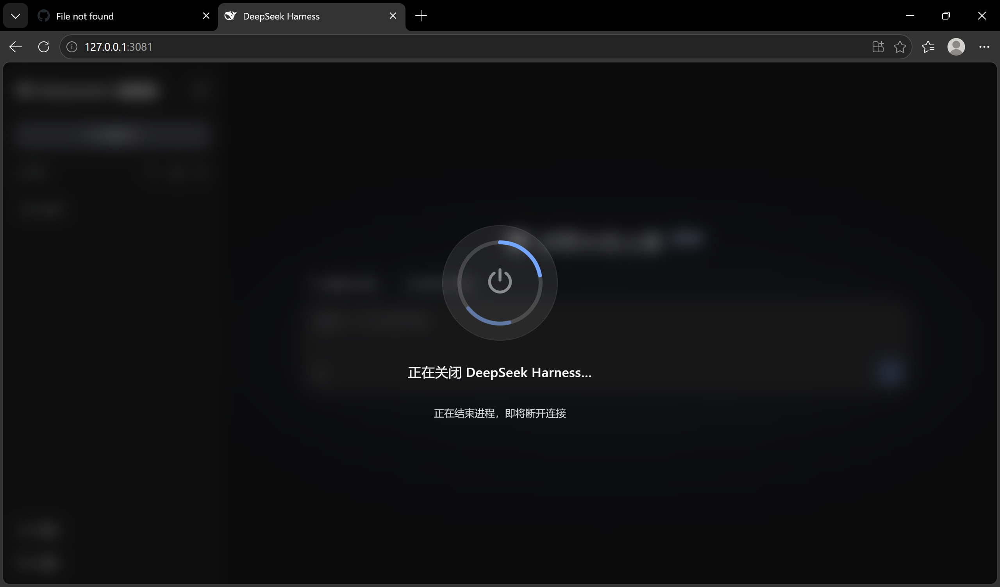

# dsh-power-button

[](LICENSE)
[](https://github.com/deepseek-ai/DeepSeek-Harness)

[English](README.md) | [中文](README.zh-CN.md)

[DeepSeek Harness](https://github.com/deepseek-ai/DeepSeek-Harness) 的自包含**电源与生命周期控制**插件:侧边栏底部**电源按钮** + 上拉**重启/关机**菜单 + 全屏过渡动画。重启/关机引擎内置在本插件中,**不依赖第三方插件**。

> 由 DeepSeek AI 辅助开发,发布前经人工 review。

## 功能

- **侧边栏电源按钮**:注册到页脚操作位(`sidebar.footer.action`),主题自适应,外观与旁边的"设置"按钮一致
- **重启/关机菜单** + Windows 关机风格全屏过渡动画;重启确认后页面自动刷新
- **自包含重启引擎**:写一个 detached 的 `.cjs` helper,经 ARM → COMMIT → ACK 握手接手拉起职责,等旧进程退出、端口释放、会话日志停止增长后,以相同的调用方式与原目录重新拉起 DSH——若原命令行是 `--port 0`,则固定为本进程实际绑定的端口——并以 `restartId` 确认新实例。不使用 PowerShell、不使用 `taskkill`
- **`/restart` 与 `/shutdown` 命令**、**`restart_harness` 模型工具**(与 `anweat/dsh-restart` 同名;若名字已被其它插件占用则跳过注册),以及只读的 **`restart_status`** 诊断工具
- **界面与宿主文案本地化**(中文 / English),跟随 profile 的 `locale.preference`
- **启动清理**:自动清理运行目录下超过 7 天的 helper 日志与脚本、每次重启的握手记录,以及尚未投递的重启通知

## 截图

**① 侧边栏电源按钮** —— 主题适配的底部常驻入口，风格与相邻的设置按钮一致。


**② 重启 / 关机菜单** —— 点击电源按钮展开，两个动作一次到位。



**③ 关机确认对话框** —— 防误触设计：默认焦点在「取消」，只有显式确认才会真正停止进程。



**④ 关机进度遮罩** —— Windows 风格全屏过渡，进程收尾时显示当前阶段。



**⑤ 重启完成提示** —— 页面自动重载后，成功提示确认 DSH 已恢复。


## 安装

```sh
dsh plugin --profile web add "github:keyiadiannao/dsh-power-button#master"
```

重启 DSH 后生效:侧边栏底部出现电源按钮。需要 Node ≥ 22.19。

## 配置

通过 profile 的 cordis 层配置(`cordis.patch.yml` 或设置界面):

| 键 | 默认 | 含义 |
|---|---|---|
| `enableModelTool` | `true` | 注册 `restart_harness` 模型工具。设 `false` 则重启仅保留在 GUI 按钮与 `/restart`。 |
| `maxDelayMs` | `5000` | 模型工具 `delayMs` 参数的上限(ms)。有效下限为 1000 ms。 |
| `restartWakeMode` | `quiet` | 重启后如何告知**发起它的那个会话**。`quiet` 只把通知暂存给它的下一个 step,不唤醒任何东西。`notify` 额外在该会话变成 live 后唤醒它,模型无需用户发消息即可报告重启结果。两种模式都不会自行再次重启。 |

示例:

```yaml
- id: dsh-power-button
  config:
    enableModelTool: true
```

## 工作原理

旧进程在有一个存活的继任者接手拉起职责之前，不得退出。这是一次显式的
ARM → COMMIT → ACK 握手：没有任何进程负责拉起是 UI 唯一无法挽回的结果，
因此 ACK 之前的任何失败都会让旧进程继续运行。

```
点击电源 → 菜单 → 重启
[宿主]   POST /api/dsh-power-button/restart
         → 写出本次重启专用的 helper .cjs(0600:其中内嵌拉起 argv)
         → spawn `node <helper>` (detached, windowsHide)
[助手]   ARM   → status { stage: 'armed', armedAt }
[宿主]   等到 ARMED(5 秒)→ 写入本次 restartId 的 COMMIT 文件
[助手]   ACK   → status { stage: 'committed', committedAt }
[宿主]   此时才:unref helper → flush 所有活跃会话(上限 5 秒)
         → 在 delayMs 后请求退出,其后有 15 秒看门狗
[助手]   等旧 PID 退出(以宿主自身的退出预算为上限)
         → 等端口释放
         → 等会话日志停止增长(静止)
         → 写 v2 marker,然后用相同 execPath/argv/cwd 拉起 DSH
           并带上 DSH_POWER_RESTART_ID 启动令牌。若原命令行是 `--port 0`,
           会被改写成本进程实际绑定的端口,使新实例落在 helper 正在等待的端口上
         → 轮询 /health 直到 ok && instanceId != 旧 && restart.restartId 匹配
         → 自删
[客户端] 轮询 health → 确认新 instanceId → 自动刷新
```

关机则 POST `/api/dsh-power-button/shutdown`,终止且不拉起。由于关机不可逆(进程停止后需手动启动),**电源按钮和 `/shutdown` 命令都会先弹确认对话框**,需要再次点击确认才执行。模型不暴露关机。

开发中踩过的坑:

- helper 必须**脱离进程树**(detached + unref),否则终止 DSH 时 helper 一起被杀
- helper 写成**真实 .cjs 文件**而非 `node -e`:多行 `node -e` 脚本会被 Windows `CreateProcess` 破坏成静默 `SyntaxError`
- 重启成功以**每次进程独立的 `instanceId` 变化**(旧→新)为准,短暂离线本身不算成功
- **持久写静止检查**:旧进程退出、端口释放后,helper 轮询所有会话日志的 `(size, mtimeMs)` 直到连续两次采样一致(上限约 15 秒)才重启。旧进程主循环退出后其会话写缓冲可能仍在落盘;在仍在追加的文件上拉起新进程会插入旧 seq 造成会话损坏——此检查封堵了这个窗口
- **启动器的退出请求要当服务读,不能当属性读**:它在 `ctx.get('appExit')`。`appExit` 是本插件未在 `inject` 中声明的可选宿主值,上下文代理会把 `ctx.appExit` 解析为 `undefined`——按属性读取会**在每次重启和关机时静默跳过优雅销毁**,直接走 `process.exit` 硬杀(丢失树销毁、存储 flush、端口释放)。官方读取方(`dsh-cmdline`、`dsh-headless`)同样走 `ctx.get`
- **优雅退出与退出前 flush 都有界**:请求 `appExit` 后,若进程仍存活,15 秒看门狗会硬退出;其前的会话 flush 上限为 5 秒。helper 等旧 PID 的耐心**由该预算推导**(flush 上限 + delayMs + 看门狗,再加余量),而不是写成第二个常量。此前 flush 无上限,夹在 helper 的 COMMIT 与进程退出之间,而 helper 只固定等 30 秒——flush 超过约 13.5 秒就足以让 helper 放弃且**不再拉起新进程**,用户落得没有服务。把两者绑成推导关系,正是防止它们日后各自漂移

## 安全

- 破坏性 POST 带 **同源/loopback 防护**(CSRF):socket 必须是 loopback、`Host` 必须是 loopback 权威、浏览器 `Origin` 必须匹配。`/api/dsh-power-button/*` 比官方 `/api` 路由更长,因此最长前缀匹配**不会**把这些请求交给 DSH 自己的 trust fence——这道防护是它们唯一的防线
- 该防护采用与 DSH 官方 fence **相同的规则**,但有一处**刻意更窄**:只接受 `127.0.0.1`、`::1`、`localhost` 作为 loopback,而官方 helper 接受整个 `127/8`。更窄不会放进任何官方会拒绝的请求;代价是若 DSH 将来监听别的 `127/8` 地址,它自己的路由会正常响应而这些端点会返回 403
- `Origin` 比较的是完整 authority,与上游一致。若浏览器真的发出不带端口的 loopback `Origin`(有报告,但并非标准),两个 fence 都会拒绝——本插件不会单方面放宽,`tests/trust-fence.spec.ts` 固定了当前行为,使改动必须是刻意的而非漂移出来的
- **at-most-once 锁**:并发重复触发会被拒绝(第二次返回 `409`)
- 模型工具 `delayMs` **下限 1000 ms**——模型无法在自身 turn 结束前杀掉进程
- 重启 marker 在启动时**消费即删除**,后续普通启动不会误报"重启过"
- 命令行日志**脱敏**(凭据不会进入 `~/.dsh/restart-helper-<pid>.log`);helper 与 marker 文件以 `0600` 写入,运行目录 `0700`

## 重启后,会话能知道什么

三件独立的事,刻意不合并成一件:

- **界面**弹出本地化的 `已重启` / `Restarted` toast。进程在整个生命周期内都
  通过 `/health` 的 `restart.fromInstanceId`、`restart.restartId` 暴露自己的
  重启身份;确认 toast 只清 pending 标志,不会抹掉身份。
- **发起重启的那个会话**会收到一条重启通知,形态由 `restartWakeMode` 决定。
  `quiet` 通过 `Agent.inject()` 把它暂存给该会话的下一个 step,不唤醒任何东西;
  `notify` 用 `Agent.followup()`,在该会话变成 live 后唤醒它,模型无需用户发消息
  即可报告重启结果。只有记录了 causal session 的重启才会发;GUI 点击不记录任何
  会话,也就**不会**被归到恰好打开着的那个会话上。每个会话最多排队一条,投递后即删除。
- **其他会话**可以调用 `restart_status` 工具,它报告那份持久记录:是否发生过
  重启、restartId、阶段、被替换的实例与新实例、各阶段时间、发起者,以及当前
  运行的进程是否就是这次重启产生的实例。模型正是靠它发现自己**没有**发起的重启。

本插件**从不自己追加模型可见的消息、不伪造 turn**。它把通知交给 Agent API:
`inject()` 会持久登记一条 `agent/inbox/spliced` 记录,交给下一个合法的 step 去
认领;`followup()` 是官方的唤醒路径。此前的设计会向恢复的会话追加合成的
`assistant/message`(`turn: 0, step: 0`)——该方案会触发 token-meter 的 step 配对
不变量并可能损坏大会话,已移除。上游跟踪:
[deepseek-ai/DeepSeek-Harness#802](https://github.com/deepseek-ai/deepseek-harness/discussions/802)。

正常运行时每条通知只投递一次。通知文件与 agent inbox 是两个**没有事务关联**的
持久状态,因此若宿主在"inbox 已写入、通知文件尚未删除"这个窗口内崩溃,下次启动会
再投递一次。这是刻意接受的:若改成先认领再投递,就是拿"可能重复"换"可能丢失",
而丢通知会直接废掉这个功能。通知文案本身也是按幂等写的——它说明重启已经发生、
不要再恢复其他有副作用的操作。

机制:
- 启动时若消费到重启 marker,`/health` 会报告 `restarted: true, fromInstanceId: <old>`
- `/health` 还会报告 `appExit: "available" | "missing"`——启动器提供的退出通道在当前宿主是否真的可解析。`missing` 意味着每次重启都退化为 `process.exit`(无优雅销毁);该字段把一次被拖慢的重启变成一次请求即可确诊,而不必等到 helper 放弃等待旧 PID 才发现
- 客户端加载后查询一次 `/health`;若 `restarted` 为真则显示 toast,然后通过
  `POST /api/dsh-power-button/notice-shown` 确认,避免刷新后重复弹出
- 重启通知走 DSH 官方的 inbox 机制,不直接 append 会话事件,因此重启**不会**损坏会话日志或留下未配对事件

## 开发

```sh
pnpm build            # tsdown:宿主 + 客户端 bundle(产物提交进 lib/)
pnpm typecheck        # tsc --noEmit,覆盖 src
pnpm typecheck:tests  # 根 tsconfig 排除了 tests/,而 vitest 只转译不做类型检查
pnpm test             # vitest:单元 + 进程级 acceptance
pnpm check            # 按顺序执行以上全部
```

`tests/restart-runtime.spec.ts` 是进程级 acceptance 套件:它把宿主真正生成的
helper 脚本(`buildRestartHelper`)**原样**作为真实进程执行,在真实 TCP 端口上对两个
假 DSH target 运行,锁定单测无法证明的那些事——完整拉起链路、没有宿主 COMMIT 就不
拉起、spawn 重试上限为三、健康门禁拒绝旧 instanceId 的回答,以及 `--port 0` 重启后
新实例确实落在旧进程实际绑定的端口上(新实例的 argv 走插件自己的 `pinRelaunchPort`,
因此测的是修复本身而非复述它)。

CI 在 Windows / Ubuntu / macOS 上运行:install、两项 typecheck、测试、build、
"提交的 `lib/` 必须与全新构建逐字节一致"的门禁(git 安装直接跑这些产物,所以它们
必须就是源码的产物),以及 `pnpm pack` 后校验发布 tarball 确实包含 `lib/` 与
`cordis.patch.yml`。另有一个单独的 Linux job 在 **Node 22.19** 上跑同样的步骤,
即 `engines.node` 声明的最低版本——除此之外没有任何地方会验证它。

测试通过 vitest setup 文件隔离 `DSH_HOME`,不会触碰真实的 `~/.dsh`。
产物:host 在 `lib/index.js`,client bundle 在 `lib/client.js`(均已入库,git 安装免构建)。

## License 与致谢

MIT。"detached helper 重新拉起"的思路参考了
[anweat/dsh-restart](https://github.com/anweat/dsh-restart)(MIT);
实现为独立编写(真实 .cjs 文件、无 PowerShell、动态端口),未复制其代码。
